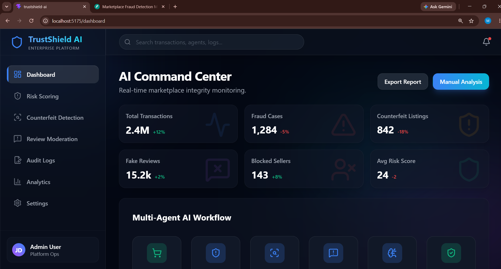
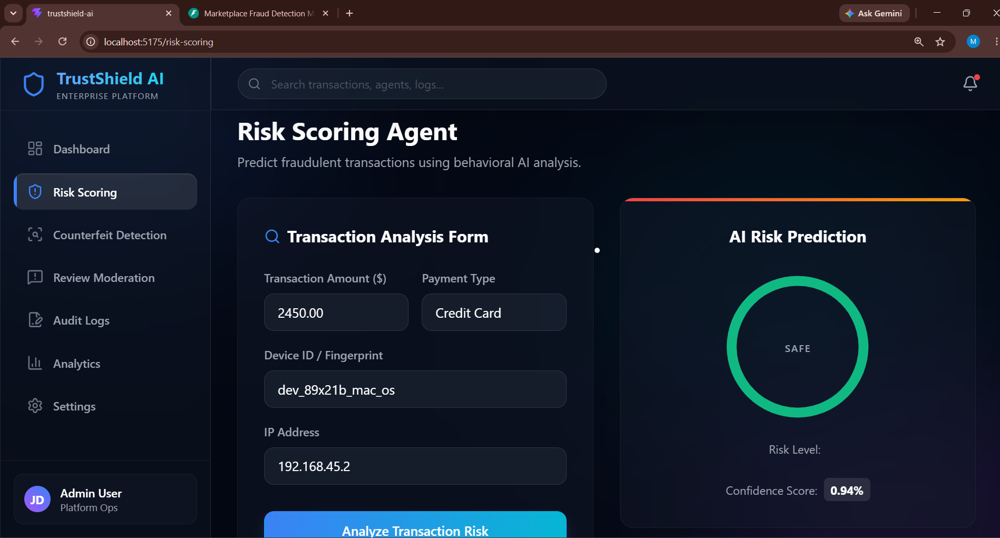
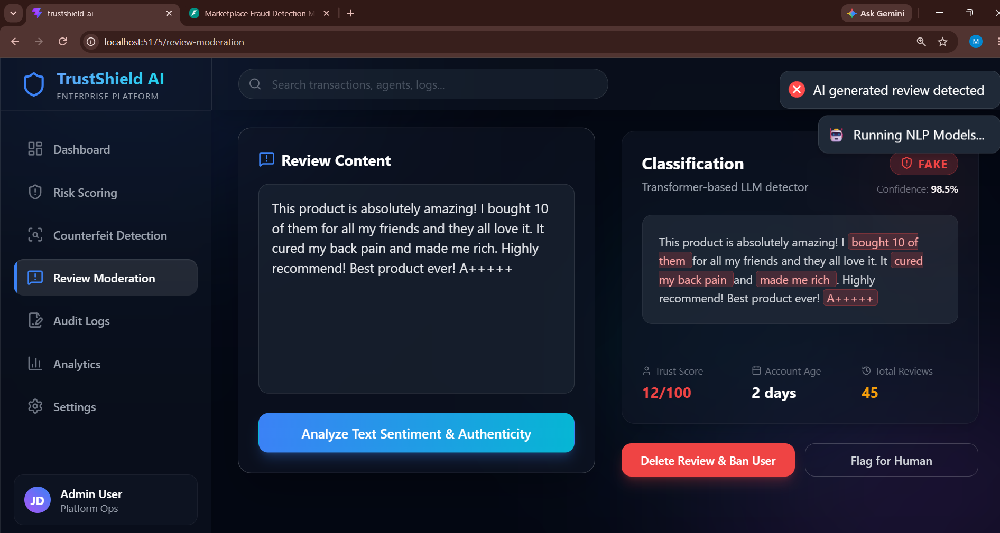
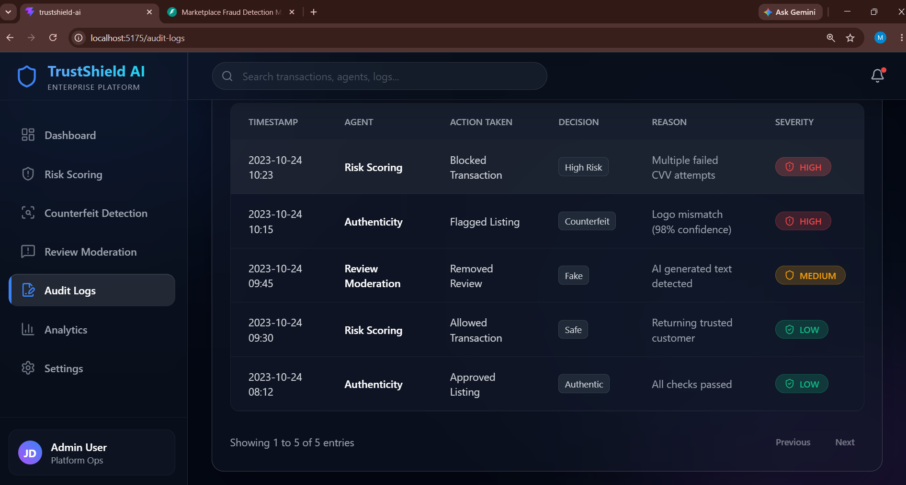

# 🛡️ TrustShield AI
**AI-Powered Trust & Safety Platform for E-Commerce**

---

## 📌 About
TrustShield AI is our **AI Build 2026** hackathon project. It helps e-commerce platforms detect fraud, counterfeit products, and fake reviews using multiple AI agents. Our goal is to improve marketplace security and build customer trust.

---

## ✨ Features
* 🛡️ **Risk Scoring Agent** – Detects suspicious transactions during checkout.
* 📸 **Authenticity Agent** – Identifies counterfeit products using price heuristics and image checks.
* 💬 **Review Moderation Agent** – Detects fake, bot-generated, and spam reviews using NLP.
* 📊 **Dashboard** – Displays real-time analytics, AI decisions, and audit logs.

---

## 🖥️ Screen Previews & Modules

### 📊 Command Center Dashboard


### 🛡️ Risk Scoring Agent


### 📸 Authenticity Agent


### 💬 Review Moderation Agent


### 📜 Audit Logs

---

## 🏗️ System Architecture

```text
                         👤 User / Seller
                                │
                                ▼
                     🌐 React Frontend (Dashboard)
                                │
                                ▼
                      ⚡ Backend API (FastAPI)
                                │
        ┌───────────────────────┼───────────────────────┐
        │                       │                       │
        ▼                       ▼                       ▼
 🛡️ Risk Scoring Agent    📸 Authenticity Agent   💬 Review Agent
        │                       │                       │
        │                       │                       │
Transaction Data         Product Images         Reviews & Metadata
Customer History         Product Details        Review Text
Payment Details          Brand & Price          User Behaviour
Device Information       Logo Detection         NLP Analysis
        │                       │                       │
        └───────────────────────┼───────────────────────┘
                                │
                                ▼
                     🤖 AI Decision Engine
                                │
                                ▼
                   📊 Dashboard & Audit Logs
